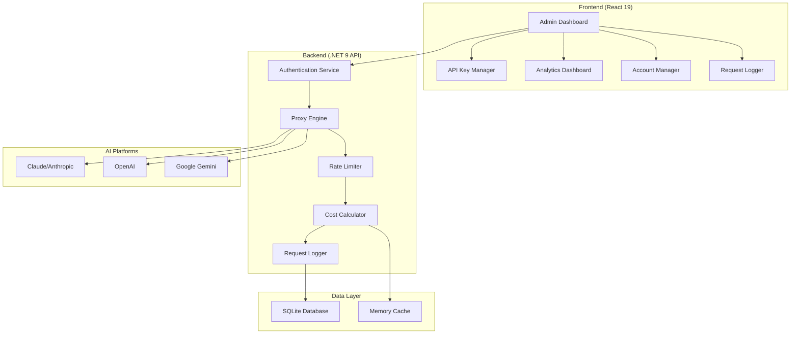

# ClaudeCodeProxy

<div align="center">


**🚀 Enterprise-Grade AI API Proxy Management Platform**

[](https://dotnet.microsoft.com/)
[](https://reactjs.org/)
[](https://www.typescriptlang.org/)
[](LICENSE)
[](https://makeapullrequest.com)

*A sophisticated, production-ready proxy management system for AI APIs with comprehensive monitoring, analytics, and multi-platform integration.*

[🚀 **Getting Started**](#getting-started) • [📖 **Documentation**](#documentation) • [🌟 **Features**](#features) • [🛠️ **API Reference**](#api-reference)

</div>

---

## 📋 Table of Contents

- [✨ Features](#-features)
- [🏗️ Architecture](#️-architecture)
- [🚀 Getting Started](#-getting-started)
- [🛠️ Installation](#️-installation)
- [⚙️ Configuration](#️-configuration)
- [📊 Dashboard](#-dashboard)
- [🔧 API Reference](#-api-reference)
- [🌐 Multi-Platform Support](#-multi-platform-support)
- [📈 Monitoring & Analytics](#-monitoring--analytics)
- [🔒 Security](#-security)
- [🤝 Contributing](#-contributing)
- [📄 License](#-license)

---

## ✨ Features

### 🎯 **Core Capabilities**

<table>
<tr>
<td width="50%">

**🔑 API Key Management**
- Multi-platform API key lifecycle management
- Granular permissions & access controls  
- Rate limiting & token quotas
- Automatic expiration handling
- Encryption at rest & in transit

**🏢 Account Integration**
- OAuth flow management
- Multi-service authentication
- Intelligent load balancing
- Automatic failover & health checks
- Priority-based routing

</td>
<td width="50%">

**📊 Advanced Analytics**
- Real-time usage monitoring
- Cost tracking & attribution
- Performance metrics (RPM/TPM)
- Predictive capacity planning
- Custom reporting dashboards

**🛡️ Enterprise Security**
- JWT-based authentication
- IP restriction controls
- Comprehensive audit logging
- Role-based access control
- Secure credential storage

</td>
</tr>
</table>

### 🎨 **Management Interface**

- **Professional Dashboard** - Real-time metrics, system health, and KPI monitoring
- **Advanced Statistics** - Multi-dimensional analytics with interactive visualizations
- **Request Logging** - Comprehensive audit trails with filtering and search capabilities
- **Cost Analysis** - Financial tracking with detailed flow analysis and forecasting
- **User Management** - Secure authentication with role-based permissions

---

## 🏗️ Architecture



### 🛠️ **Tech Stack**

| Component | Technology | Version |
|-----------|------------|---------|
| **Backend** | .NET Core | 9.0 |
| **Frontend** | React + TypeScript | 19.x + 5.6 |
| **Database** | SQLite + EF Core | Latest |
| **UI Framework** | Tailwind CSS + Shadcn/ui | 3.x |
| **Build Tool** | Vite | 6.x |
| **Authentication** | JWT | - |

---

## 🚀 Getting Started

### 📋 Prerequisites

- [.NET 9 SDK](https://dotnet.microsoft.com/download/dotnet/9.0)
- [Node.js 20+](https://nodejs.org/) 
- [npm/yarn/pnpm](https://www.npmjs.com/)

### ⚡ Quick Start

1. **Clone the repository**
   ```bash
   git clone https://github.com/AIDotNet/ClaudeCodeProxy.git
   cd ClaudeCodeProxy
   ```

2. **Start the backend**
   ```bash
   cd src/ClaudeCodeProxy.Host
   dotnet restore
   dotnet run
   ```

3. **Start the frontend**
   ```bash
   cd web
   npm install
   npm run dev
   ```

4. **Access the application**
   - Frontend: http://localhost:5173
   - Backend API: http://localhost:5000
   - Swagger UI: http://localhost:5000/scalar/v1

---

## 🛠️ Installation

### 🐳 Docker Deployment

```bash
# Build and run with Docker Compose
docker-compose up -d
```

### 🖥️ Manual Deployment

1. **Backend Setup**
   ```bash
   cd src/ClaudeCodeProxy.Host
   dotnet publish -c Release -o ./publish
   cd publish
   dotnet ClaudeCodeProxy.Host.dll
   ```

2. **Frontend Build**
   ```bash
   cd web
   npm run build
   # Serve the dist folder with your preferred web server
   ```

---

## ⚙️ Configuration

### 🔧 Environment Variables

Create `appsettings.json` in the Host project:

```json
{
  "ThorPlatformOptions": {
    "DatabaseConnectionString": "Data Source=claudecodeproxy.db",
    "JwtSettings": {
      "SecretKey": "your-secret-key-here",
      "Issuer": "ClaudeCodeProxy",
      "Audience": "ClaudeCodeProxy-Users",
      "ExpirationHours": 24
    }
  },
  "Logging": {
    "LogLevel": {
      "Default": "Information",
      "Microsoft.AspNetCore": "Warning"
    }
  }
}
```

### 🎛️ Frontend Configuration

Update `web/src/config/api.ts`:

```typescript
export const API_CONFIG = {
  baseURL: process.env.VITE_API_URL || 'http://localhost:5000',
  timeout: 30000,
  retries: 3
};
```

---

## 📊 Dashboard

### 🎯 **Real-time Metrics**


**Key Features:**
- Live system performance indicators
- Cost tracking with trend analysis
- Token usage analytics (input/output/cache)
- API key status monitoring
- System uptime and health metrics

### 📈 **Advanced Analytics**

- **Usage Heat Maps** - Visual representation of API usage patterns
- **Cost Flow Analysis** - Detailed financial attribution and forecasting
- **Performance Trends** - Historical data with predictive insights
- **User Profiling** - Behavioral analysis and usage optimization

---

## 🔧 API Reference

### 🔐 Authentication

All API endpoints require JWT authentication:

```bash
# Login to get JWT token
curl -X POST "http://localhost:5000/api/auth/login" \
  -H "Content-Type: application/json" \
  -d '{"username":"admin","password":"password"}'

# Use token in subsequent requests
curl -H "Authorization: Bearer YOUR_JWT_TOKEN" \
  "http://localhost:5000/api/apikeys"
```

### 📝 Core Endpoints

| Method | Endpoint | Description |
|--------|----------|-------------|
| `GET` | `/api/apikeys` | List all API keys |
| `POST` | `/api/apikeys` | Create new API key |
| `PUT` | `/api/apikeys/{id}` | Update API key |
| `DELETE` | `/api/apikeys/{id}` | Delete API key |
| `GET` | `/api/accounts` | List service accounts |
| `GET` | `/api/dashboard` | Dashboard statistics |
| `GET` | `/api/logs` | Request logs |

### 🔄 Proxy Endpoints

```bash
# Claude API Proxy
curl -X POST "http://localhost:5000/v1/messages" \
  -H "Authorization: Bearer YOUR_API_KEY" \
  -H "Content-Type: application/json" \
  -d '{"model":"claude-3-sonnet","messages":[...]}'

# OpenAI API Proxy  
curl -X POST "http://localhost:5000/v1/chat/completions" \
  -H "Authorization: Bearer YOUR_API_KEY" \
  -H "Content-Type: application/json" \
  -d '{"model":"gpt-4","messages":[...]}'
```

---

## 🌐 Multi-Platform Support

### 🤖 **Supported AI Platforms**

<table>
<tr>
<td align="center">
<br>
<b>Claude</b><br>
OAuth Integration
</td>
<td align="center">
<br>
<b>OpenAI</b><br>
Full API Support
</td>
<td align="center">
<br>
<b>Gemini</b><br>
Project-based Auth
</td>
</tr>
</table>

### ⚡ **Platform Features**

- **Intelligent Routing** - Automatic platform selection based on request parameters
- **Model Mapping** - Cross-platform model compatibility management  
- **Cost Calculation** - Platform-specific pricing models and usage tracking
- **Error Handling** - Platform-specific error codes and retry logic

---

## 📈 Monitoring & Analytics

### 📊 **Metrics Collection**

- **Request/Response Tracking** - Complete API transaction logging
- **Token Usage Monitoring** - Detailed input/output token calculation
- **Cost Attribution** - Real-time cost calculation and allocation
- **Performance Metrics** - Response time, throughput, and error rates

### 🚨 **Alerting & Notifications**

- Real-time status updates and system health monitoring
- Usage threshold alerts with automatic notifications
- Error tracking with immediate notification of system issues
- Capacity planning with proactive scaling recommendations

---

## 🔒 Security

### 🛡️ **Security Features**

- **🔐 JWT Authentication** - Secure token-based authentication with configurable expiration
- **🔒 Encrypted Storage** - API keys encrypted at rest and in transit
- **🚦 Rate Limiting** - Comprehensive throttling to prevent abuse
- **🌐 IP Restrictions** - Client IP whitelisting for enhanced access control
- **📋 Audit Logging** - Complete audit trails for compliance and security monitoring

### 🔧 **Security Best Practices**

```json
{
  "SecurityRecommendations": {
    "JwtSecretKey": "Use a strong, randomly generated secret key (256+ bits)",
    "DatabaseEncryption": "Enable SQLite encryption in production environments",
    "TLS": "Always use HTTPS in production deployments",
    "RateLimiting": "Configure appropriate rate limits based on your usage patterns",
    "Monitoring": "Enable comprehensive logging and monitoring for security events"
  }
}
```

---

## 🤝 Contributing

We welcome contributions! Please see our [Contributing Guide](CONTRIBUTING.md) for details.

### 🚀 **Development Setup**

1. Fork the repository
2. Create a feature branch (`git checkout -b feature/AmazingFeature`)
3. Commit your changes (`git commit -m 'Add some AmazingFeature'`)
4. Push to the branch (`git push origin feature/AmazingFeature`)
5. Open a Pull Request

### 📝 **Code Style**

- **Backend**: Follow [.NET coding conventions](https://docs.microsoft.com/en-us/dotnet/csharp/programming-guide/inside-a-program/coding-conventions)
- **Frontend**: ESLint + Prettier configuration included
- **Commit Messages**: Use [Conventional Commits](https://www.conventionalcommits.org/)

---

## 📄 License

This project is licensed under the MIT License - see the [LICENSE](LICENSE) file for details.

---

## 🙏 Acknowledgments

- [Anthropic](https://www.anthropic.com/) for Claude API
- [OpenAI](https://openai.com/) for GPT APIs  
- [Google](https://ai.google.dev/) for Gemini API
- [Shadcn/ui](https://ui.shadcn.com/) for UI components
- [Tailwind CSS](https://tailwindcss.com/) for styling

---

<div align="center">

**⭐ Star this repo if you find it helpful!**

[🐛 Report Bug](https://github.com/your-username/ClaudeCodeProxy/issues) • [✨ Request Feature](https://github.com/your-username/ClaudeCodeProxy/issues) • [💬 Discussions](https://github.com/your-username/ClaudeCodeProxy/discussions)

</div>

---

<div align="center">

## 🌍 Documentation

**📚 [English](README.md) | [中文文档](README.zh-CN.md)**

**⭐ Star this repo if you find it helpful!**

[🐛 Report Bug](https://github.com/your-username/ClaudeCodeProxy/issues) • [✨ Request Feature](https://github.com/your-username/ClaudeCodeProxy/issues) • [💬 Discussions](https://github.com/your-username/ClaudeCodeProxy/discussions)

Made with ❤️ by the ClaudeCodeProxy Team

</div>
