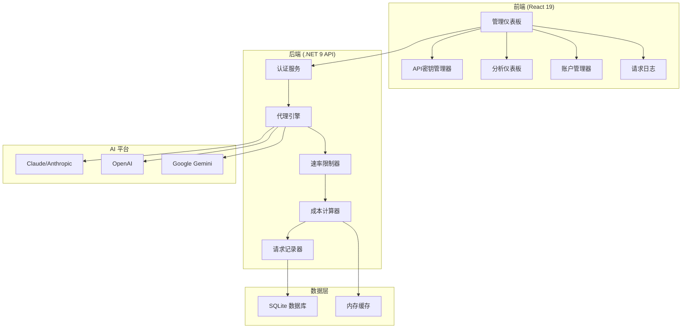

# ClaudeCodeProxy 中文文档

<div align="center">


**🚀 企业级 AI API 代理管理平台**

[](https://dotnet.microsoft.com/)
[](https://reactjs.org/)
[](https://www.typescriptlang.org/)
[](LICENSE)
[](https://makeapullrequest.com)

*一个复杂的、生产就绪的 AI API 代理管理系统，具有全面的监控、分析和多平台集成功能。*

[🚀 **快速开始**](#快速开始) • [📖 **使用文档**](#使用文档) • [🌟 **功能特性**](#功能特性) • [🛠️ **API 参考**](#api-参考)

</div>

---

## 📋 目录

- [✨ 功能特性](#-功能特性)
- [🏗️ 系统架构](#️-系统架构)
- [🚀 快速开始](#-快速开始)
- [🛠️ 安装部署](#️-安装部署)
- [⚙️ 配置说明](#️-配置说明)
- [📊 管理面板](#-管理面板)
- [🔧 API 参考](#-api-参考)
- [🌐 多平台支持](#-多平台支持)
- [📈 监控分析](#-监控分析)
- [🔒 安全说明](#-安全说明)
- [🤝 参与贡献](#-参与贡献)
- [📄 开源协议](#-开源协议)

---

## ✨ 功能特性

### 🎯 **核心能力**

<table>
<tr>
<td width="50%">

**🔑 API 密钥管理**
- 多平台 API 密钥生命周期管理
- 细粒度权限与访问控制
- 速率限制与令牌配额
- 自动过期处理
- 静态与传输加密

**🏢 账户集成**
- OAuth 流程管理
- 多服务认证
- 智能负载均衡
- 自动故障转移与健康检查
- 基于优先级的路由

</td>
<td width="50%">

**📊 高级分析**
- 实时使用监控
- 成本跟踪与归因
- 性能指标（RPM/TPM）
- 预测性容量规划
- 自定义报表仪表板

**🛡️ 企业安全**
- 基于 JWT 的认证
- IP 限制控制
- 全面审计日志
- 基于角色的访问控制
- 安全凭证存储

</td>
</tr>
</table>

### 🎨 **管理界面**

- **专业仪表板** - 实时指标、系统健康状态和 KPI 监控
- **高级统计** - 多维度分析与交互式可视化
- **请求日志** - 全面的审计轨迹，支持过滤和搜索功能
- **成本分析** - 财务跟踪，包含详细流向分析和预测
- **用户管理** - 安全认证与基于角色的权限管理

---

## 🏗️ 系统架构



### 🛠️ **技术栈**

| 组件 | 技术 | 版本 |
|------|------|------|
| **后端** | .NET Core | 9.0 |
| **前端** | React + TypeScript | 19.x + 5.6 |
| **数据库** | SQLite + EF Core | 最新版 |
| **UI 框架** | Tailwind CSS + Shadcn/ui | 3.x |
| **构建工具** | Vite | 6.x |
| **认证** | JWT | - |

---

## 🚀 快速开始

### 📋 环境要求

- [.NET 9 SDK](https://dotnet.microsoft.com/download/dotnet/9.0)
- [Node.js 20+](https://nodejs.org/) 
- [npm/yarn/pnpm](https://www.npmjs.com/)

### ⚡ 快速启动

1. **克隆仓库**
   ```bash
   git clone https://github.com/AIDotNet/ClaudeCodeProxy.git
   cd ClaudeCodeProxy
   ```

2. **启动后端**
   ```bash
   cd src/ClaudeCodeProxy.Host
   dotnet restore
   dotnet run
   ```

3. **启动前端**
   ```bash
   cd web
   npm install
   npm run dev
   ```

4. **访问应用**
   - 前端界面: http://localhost:5173
   - 后端 API: http://localhost:5000
   - API 文档: http://localhost:5000/scalar/v1

---

## 🛠️ 安装部署

### 🐳 Docker 部署

```bash
# 使用 Docker Compose 构建并运行
docker-compose up -d
```

### 🖥️ 手动部署

1. **后端设置**
   ```bash
   cd src/ClaudeCodeProxy.Host
   dotnet publish -c Release -o ./publish
   cd publish
   dotnet ClaudeCodeProxy.Host.dll
   ```

2. **前端构建**
   ```bash
   cd web
   npm run build
   # 使用您首选的 Web 服务器提供 dist 文件夹
   ```

---

## ⚙️ 配置说明

### 🔧 环境变量

在 Host 项目中创建 `appsettings.json`：

```json
{
  "ThorPlatformOptions": {
    "DatabaseConnectionString": "Data Source=claudecodeproxy.db",
    "JwtSettings": {
      "SecretKey": "your-secret-key-here",
      "Issuer": "ClaudeCodeProxy",
      "Audience": "ClaudeCodeProxy-Users",
      "ExpirationHours": 24
    }
  },
  "Logging": {
    "LogLevel": {
      "Default": "Information",
      "Microsoft.AspNetCore": "Warning"
    }
  }
}
```

### 🎛️ 前端配置

更新 `web/src/config/api.ts`：

```typescript
export const API_CONFIG = {
  baseURL: process.env.VITE_API_URL || 'http://localhost:5000',
  timeout: 30000,
  retries: 3
};
```

---

## 📊 管理面板

### 🎯 **实时指标**


**主要功能:**
- 实时系统性能指标
- 趋势分析的成本跟踪
- 令牌使用分析（输入/输出/缓存）
- API 密钥状态监控
- 系统运行时间和健康指标

### 📈 **高级分析**

- **使用热力图** - API 使用模式的可视化展示
- **成本流向分析** - 详细的财务归因和预测
- **性能趋势** - 具有预测洞察的历史数据
- **用户画像** - 行为分析和使用优化

---

## 🔧 API 参考

### 🔐 认证

所有 API 端点都需要 JWT 认证：

```bash
# 登录获取 JWT 令牌
curl -X POST "http://localhost:5000/api/auth/login" \
  -H "Content-Type: application/json" \
  -d '{"username":"admin","password":"password"}'

# 在后续请求中使用令牌
curl -H "Authorization: Bearer YOUR_JWT_TOKEN" \
  "http://localhost:5000/api/apikeys"
```

### 📝 核心端点

| 方法 | 端点 | 描述 |
|------|------|------|
| `GET` | `/api/apikeys` | 列出所有 API 密钥 |
| `POST` | `/api/apikeys` | 创建新的 API 密钥 |
| `PUT` | `/api/apikeys/{id}` | 更新 API 密钥 |
| `DELETE` | `/api/apikeys/{id}` | 删除 API 密钥 |
| `GET` | `/api/accounts` | 列出服务账户 |
| `GET` | `/api/dashboard` | 仪表板统计 |
| `GET` | `/api/logs` | 请求日志 |

### 🔄 代理端点

```bash
# Claude API 代理
curl -X POST "http://localhost:5000/v1/messages" \
  -H "Authorization: Bearer YOUR_API_KEY" \
  -H "Content-Type: application/json" \
  -d '{"model":"claude-3-sonnet","messages":[...]}'

# OpenAI API 代理  
curl -X POST "http://localhost:5000/v1/chat/completions" \
  -H "Authorization: Bearer YOUR_API_KEY" \
  -H "Content-Type: application/json" \
  -d '{"model":"gpt-4","messages":[...]}'
```

---

## 🌐 多平台支持

### 🤖 **支持的 AI 平台**

<table>
<tr>
<td align="center">
<br>
<b>Claude</b><br>
OAuth 集成
</td>
<td align="center">
<br>
<b>OpenAI</b><br>
完整 API 支持
</td>
<td align="center">
<br>
<b>Gemini</b><br>
基于项目的认证
</td>
</tr>
</table>

### ⚡ **平台特性**

- **智能路由** - 基于请求参数的自动平台选择
- **模型映射** - 跨平台模型兼容性管理
- **成本计算** - 平台特定的定价模型和使用跟踪
- **错误处理** - 平台特定的错误代码和重试逻辑

---

## 📈 监控分析

### 📊 **指标收集**

- **请求/响应跟踪** - 完整的 API 事务日志记录
- **令牌使用监控** - 详细的输入/输出令牌计算
- **成本归因** - 实时成本计算和分配
- **性能指标** - 响应时间、吞吐量和错误率

### 🚨 **告警与通知**

- 实时状态更新和系统健康监控
- 使用阈值告警和自动通知
- 错误跟踪和系统问题的即时通知
- 容量规划和主动扩展建议

---

## 🔒 安全说明

### 🛡️ **安全特性**

- **🔐 JWT 认证** - 具有可配置过期时间的安全基于令牌的认证
- **🔒 加密存储** - API 密钥静态和传输加密
- **🚦 速率限制** - 全面的节流以防止滥用
- **🌐 IP 限制** - 客户端 IP 白名单增强访问控制
- **📋 审计日志** - 用于合规和安全监控的完整审计轨迹

### 🔧 **安全最佳实践**

```json
{
  "安全建议": {
    "JWT密钥": "使用强随机生成的密钥（256+ 位）",
    "数据库加密": "在生产环境中启用 SQLite 加密",
    "TLS": "在生产部署中始终使用 HTTPS",
    "速率限制": "根据您的使用模式配置适当的速率限制",
    "监控": "为安全事件启用全面的日志记录和监控"
  }
}
```

---

## 🤝 参与贡献

我们欢迎贡献！请查看我们的[贡献指南](CONTRIBUTING.md)了解详情。

### 🚀 **开发设置**

1. Fork 此仓库
2. 创建功能分支 (`git checkout -b feature/AmazingFeature`)
3. 提交您的更改 (`git commit -m 'Add some AmazingFeature'`)
4. 推送到分支 (`git push origin feature/AmazingFeature`)
5. 开启 Pull Request

### 📝 **代码风格**

- **后端**: 遵循 [.NET 编码约定](https://docs.microsoft.com/zh-cn/dotnet/csharp/programming-guide/inside-a-program/coding-conventions)
- **前端**: 包含 ESLint + Prettier 配置
- **提交消息**: 使用 [约定式提交](https://www.conventionalcommits.org/zh-hans/)

---

## 📄 开源协议

本项目采用 MIT 许可证 - 查看 [LICENSE](LICENSE) 文件了解详情。

---

## 🙏 致谢

- [Anthropic](https://www.anthropic.com/) 提供 Claude API
- [OpenAI](https://openai.com/) 提供 GPT API  
- [Google](https://ai.google.dev/) 提供 Gemini API
- [Shadcn/ui](https://ui.shadcn.com/) 提供 UI 组件
- [Tailwind CSS](https://tailwindcss.com/) 提供样式框架

---

<div align="center">

**⭐ 如果这个项目对您有帮助，请给我们一个星标！**

[🐛 报告 Bug](https://github.com/your-username/ClaudeCodeProxy/issues) • [✨ 功能请求](https://github.com/your-username/ClaudeCodeProxy/issues) • [💬 讨论](https://github.com/your-username/ClaudeCodeProxy/discussions)

</div>

---

<div align="center">

## 📞 支持与反馈

如果您在使用过程中遇到任何问题，或有功能建议，请通过以下方式联系我们：

- 🐛 [报告问题](https://github.com/your-username/ClaudeCodeProxy/issues)
- 💡 [功能请求](https://github.com/your-username/ClaudeCodeProxy/issues)
- 💬 [社区讨论](https://github.com/your-username/ClaudeCodeProxy/discussions)

**如果这个项目对您有帮助，请给我们一个 ⭐!**

Made with ❤️ by the ClaudeCodeProxy Team

</div>
